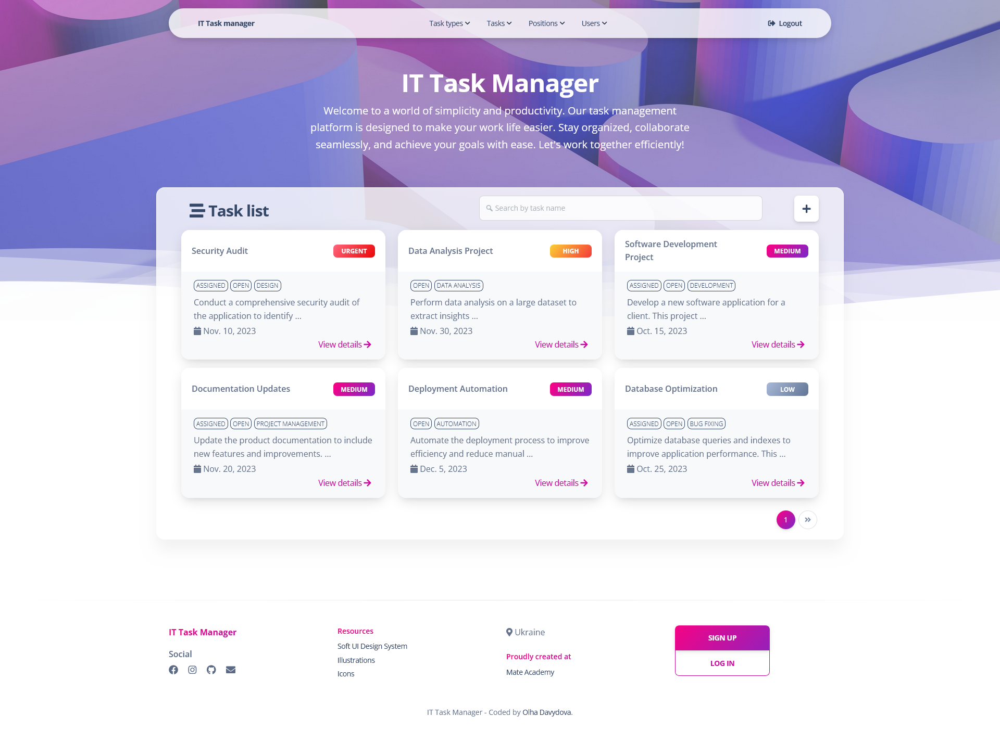

# IT Task Manager Project
> **Empowering Teams, Simplifying Tasks:** Your Ultimate IT Task Management Solution

The IT Task Manager is an invaluable tool for organizations, 
offering streamlined task management and team collaboration. 
With this application, users can efficiently create, assign, 
and monitor tasks, ensuring that work progresses smoothly and deadlines are met. 
Additionally, it simplifies workforce management, 
enabling you to keep track of worker assignments and positions, 
making it a comprehensive solution for efficient project and team management.

## Installation

Python3 must be already installed.

```shell
git clone https://github.com/o-davydova/IT-task-manager
cd IT-task-manager
python3 -m venv venv
source venv/Scripts/activate
pip install -r requirements.txt
python manage.py runserver #starts Django Server
```

It sets up a virtual environment, installs the necessary dependencies, 
and starts the Django server, making your IT Task Manager project 
accessible for use and development

## Features

What's all the bells and whistles this project can perform?
* **Task Management:** Create, assign, and track tasks.
* **Worker Management:** Manage worker assignments.
* **Task Types:** Categorize tasks for organization.
* **User-Friendly Interface:** Intuitive navigation.
* **Search Functionality:** Quickly find tasks and workers.
* **User Registration and Authentication:** Register and log in for controlled access.
* **Task Prioritization:** Assign task priorities.

## Demo
### Check it out!

[IT task manager project deployed to Render](https://it-task-manager-byfm.onrender.com/)

### Test User Account

For testing and demonstration purposes, you can use the following test user account to log in:

- **Username:** testuser
- **Password:** testpassword

Feel free to use this test account to explore the functionality of the IT Task Manager project.

**Note:** It's recommended to change the password for this test user when deploying the application in a production environment.


